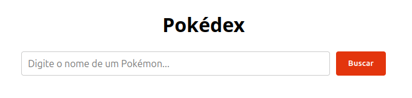
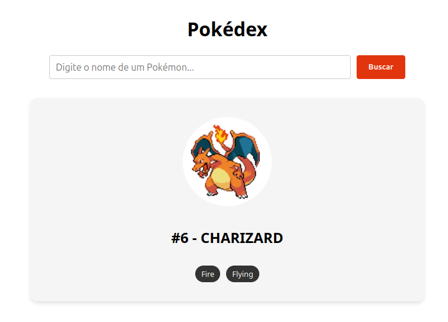

# 🌐 API Consumer Data App

[🇺🇸 English](./README.md) | [🇧🇷 Português](./README.pt-br.md)

A responsive web application built with **React** and **TypeScript** to demonstrate REST API integration, asynchronous data fetching, state management, and responsive interface development. The application retrieves data from an external API and presents it in a clean, user-friendly interface.

## 📸 Demo

<p align="center">
  
</p>

<p align="center">
  
</p>

---

## ✨ Features

* 🌐 Integration with an external REST API.
* ⚡ Asynchronous data fetching using `async/await`.
* 🔄 Loading indicators during requests.
* ❌ Error handling with user-friendly feedback.
* 🔍 Dynamic search and filtering *(if applicable)*.
* 📱 Fully responsive interface.
* 🔄 Automatic rendering of API data.

---

## 🛠️ Technologies

* React 18/19
* TypeScript
* Fetch API
* Vite

---

## 📂 Project Structure

```text
src/
├── assets/
├── components/
│   └── PokemonCard.tsx
├── interfaces/
│   └── Pokemon.ts
├── services/
│   └── api.ts
├── App.tsx
└── main.tsx
```

---

## 💡 Technical Concepts

This project focuses on applying best practices for consuming REST APIs in React applications.

### State Management & Form Actions (React 19)

This project leverages the modern capabilities of **React 19**, specifically the `useActionState` hook, completely eliminating the need for traditional `useState` and `useEffect` for data fetching.

```tsx
const [state, formAction, isPending] = useActionState(
  async (_prevState: SearchState, formData: FormData) => {
    const query = formData.get('searchQuery') as string;
    // Data fetching logic here...
  },
  initialState
);
```

### Type Safety

All API responses are typed using TypeScript interfaces, ensuring predictable data structures and reducing runtime errors.

```ts
interface Data {
  id: number;
  name: string;
  sprites: { front_Default: string };
  types: PokemonType[];
}
```

### API Consumption

The application communicates with a REST API using either the native **Fetch API**, depending on the project's configuration.

---

## 🎨 Responsive Design

The interface was designed with a mobile-first approach, ensuring a consistent experience across desktops, tablets, and smartphones.

---

## 🚀 Getting Started

### Clone the repository

```bash
git clone https://github.com/paullo-ps/consome-api-publica.git
```

### Navigate to the project folder

```bash
cd consome_api_publica
```

### Install dependencies

**Using npm**

```bash
npm install
```

**Using Yarn**

```bash
yarn
```

### Start the development server

**Using npm**

```bash
npm run dev
```

**Using Yarn**

```bash
yarn dev
```

The application will be available at:

```text
http://localhost:5173
```

---

## 📚 What I Learned

This project helped reinforce my knowledge of:

* REST API integration
* Asynchronous JavaScript
* TypeScript
* State management
* Error handling
* Loading states
* Component-based architecture
* Responsive design
* Front-end development best practices

---

## 🔮 Future Improvements

* Pagination.
* Infinite scrolling.
* API caching.
* Authentication.
* Dark mode.
* Unit tests with Vitest and React Testing Library.
* Debounced search.
* Request cancellation using `AbortController`.
* Environment variables for API configuration.

---

## 👨‍💻 Author

**Paulo Sérgio Mendes dos Santos**

* GitHub: https://github.com/paullo-ps
* LinkedIn: https://www.linkedin.com/in/paulo-s%C3%A9rgio-mendes-dos-santos-914a29200/
